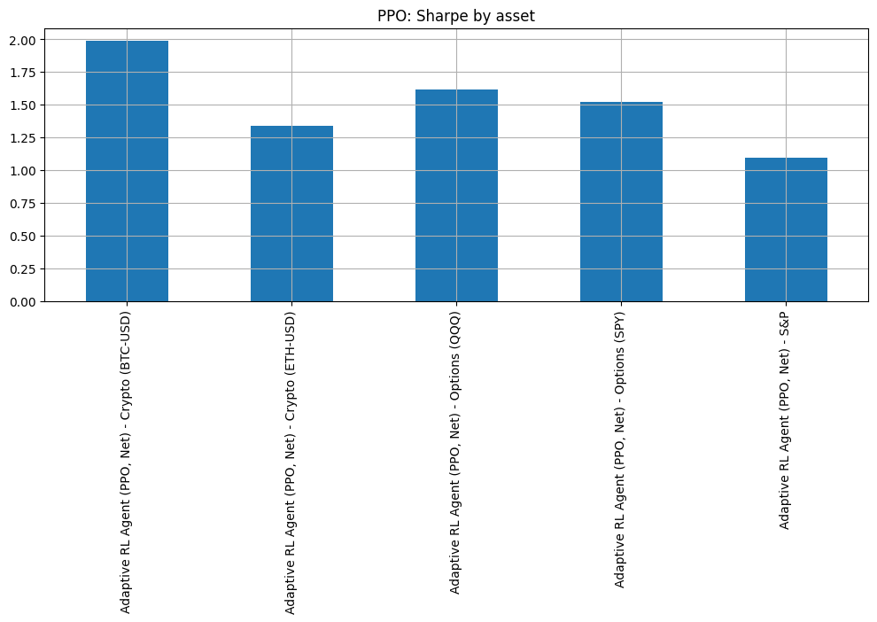
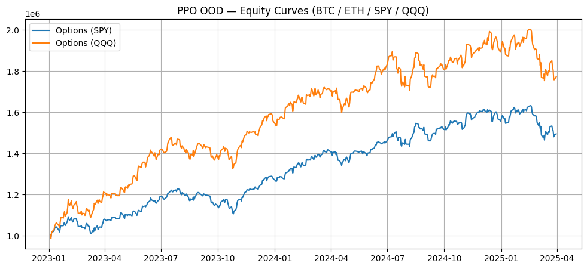
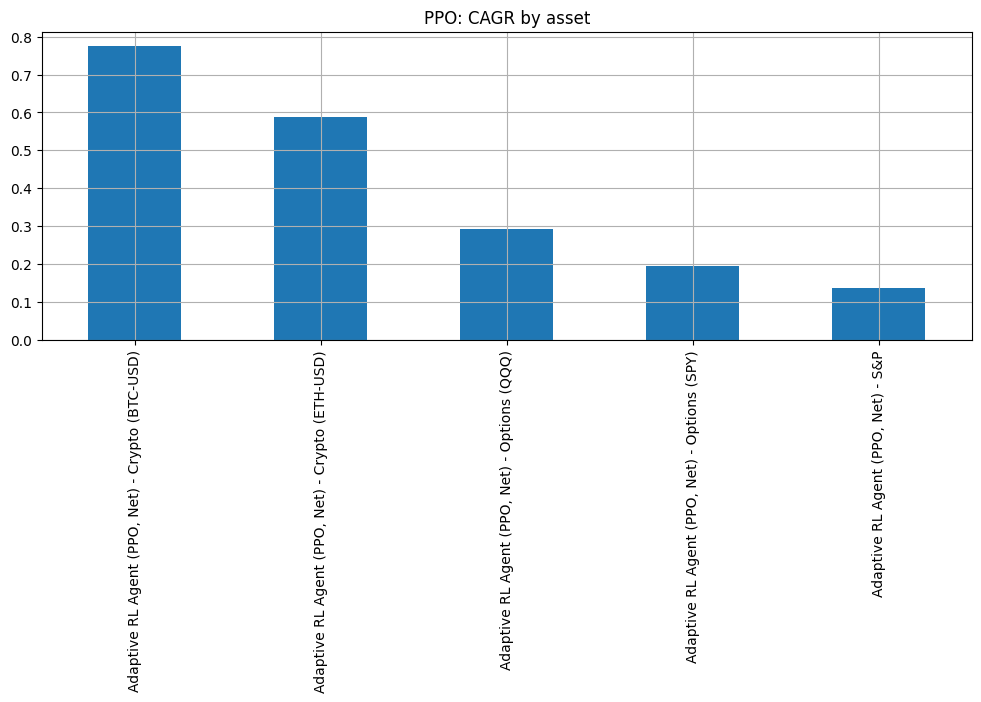

# Adaptive RL for Regime-Aware Trading (VAE + PPO)

> **Hybrid representation learning + reinforcement learning** for market regime detection and adaptive trading across equities, crypto, and options — with strict **t→t+1 causal evaluation** (no look-ahead), transaction costs, and reproducible plots.

<p align="center">
  
</p>

# 📑 Dataset Information
This project integrates multi-asset datasets to evaluate β-VAE + PPO reinforcement learning for regime detection and adaptive trading.

## 1. Equities (S&P 500)
Source: Yahoo Finance (yfinance) or equivalent vendor (Bloomberg/Quandl if licensed).
Universe: ~468 S&P 500 tickers (2015–2025).

# # Fields:
date: trading day (YYYY-MM-DD)
tic: stock ticker (AAPL, MSFT, AMZN, etc.)
open, high, low, close, adj_close: daily OHLC prices
volume: daily trading volume

##  Features engineered (≈1872 dims):
Log returns, rolling volatility, momentum, EWMA
Z-score volume anomalies
Rolling Sharpe, sector dummy encodings

## 3. Cryptocurrencies
Source: Yahoo Finance (yfinance) — BTC-USD, ETH-USD.
Period: 2015–2025 (daily).
Fields: same as equities (OHLCV).
Purpose: Out-of-distribution (OOD) evaluation of PPO agent.


## Notes:
BTC shows 77% CAGR, Sharpe ~1.99
ETH shows 59% CAGR, Sharpe ~1.34
Larger drawdowns (−20% to −30%) compared to equities.


## 5. Options (SPY, QQQ)
Source: CBOE / Yahoo Finance options chain (end-of-day).
Underlying: SPY (S&P 500 ETF), QQQ (Nasdaq-100 ETF).

Contracts used:
ATM (At-the-money) monthly call/put options
Rolled forward at expiry to maintain continuous exposure

## Fields:
date: trading day
underlying: SPY or QQQ
option_price: midpoint of bid/ask
implied_vol: Black–Scholes implied volatility (from CBOE)
open_interest, volume

Purpose: Evaluate PPO policy generalization to derivative instruments.


## 7. Merged Dataset & Pipeline
   
All assets resampled to daily frequency and aligned on date.
Equities → β-VAE latent training.

Crypto + Options → PPO OOD evaluation only (no leakage).
Final matrix shape:

## Equities: 468 tickers × 10 yrs ≈ 1.2M rows
Crypto: 2 tickers × 10 yrs ≈ 5k rows each
Options: 2 underlyings × monthly rolls × 10 yrs ≈ 120 rolls

## 🔍 What’s inside

* **β-VAE (500 epochs)** learns latent market states from 1,800+ engineered features over 468 stocks
* **GMM** selects regimes (K chosen by BIC), **Calm** state picked by train-period Sharpe
* **PPO (200k timesteps)** learns an adaptive policy with slippage + cost penalties
* **Baselines**: Hard (EWMA + hysteresis + dwell) & Soft (probabilistic allocation)
* **Causal eval**: positions at *t* apply to **r<sub>t+1</sub>**; no information leakage

## 🚀 3-line highlights (ATS-friendly)

* Developed a **Hybrid β-VAE + PPO RL pipeline** for **regime detection** and **alpha generation**, using GMM clustering and strict **t→t+1** evaluation.
* Engineered **cross-asset strategies** (equities, crypto, options) with Sharpe up to **1.99 (BTC)**, **1.61 (QQQ)** and CAGR up to **77%**, outperforming allocation baselines.
* Implemented the **full research stack**: 468-stock feature set (1872 dims), β-VAE reps, Stable-Baselines3 PPO (200k steps), and risk-adjusted metrics (**Sharpe, Sortino, Calmar, Max DD**).

---

## 📊 Key results (test period)

| Strategy / Asset                |      CAGR |   Vol |   Sharpe |  Sortino |   Calmar | Max DD |
| ------------------------------- | --------: | ----: | -------: | -------: | -------: | -----: |
| Baseline (Equal-Weighted, S\&P) |     0.152 | 0.128 |     1.19 |     1.88 |     1.26 | -0.121 |
| **Soft Allocation (Net, S\&P)** | **0.168** | 0.136 | **1.23** | **1.93** | **1.31** | -0.128 |
| PPO (Net, **S\&P**)             |     0.136 | 0.124 |     1.10 |     1.75 |     1.08 | -0.126 |
| PPO (Net, **Options SPY**)      |     0.195 | 0.128 | **1.52** |     2.23 |     1.90 | -0.103 |
| PPO (Net, **Options QQQ**)      |     0.291 | 0.180 | **1.62** |     2.37 |     2.35 | -0.124 |
| PPO (Net, **BTC-USD**)          | **0.774** | 0.390 | **1.99** |     3.11 | **3.86** | -0.201 |
| PPO (Net, **ETH-USD**)          |     0.587 | 0.438 |     1.34 |     2.10 |     2.04 | -0.288 |

> All runs include **0.10% transaction cost + 0.05% slippage** and **causal** t→t+1 alignment.

---

## 🗂️ Repo structure

```
.
├── README.md
├── requirements.txt
├── data/
│   └── S&P500_all_companies.csv         # input (date,tic,close,volume)
├── src/
│   ├── config.py                        # CONFIG dict (see below)
│   ├── vae.py                           # β-VAE model + loss
│   ├── envs.py                          # causal Gymnasium trading env
│   ├── regimes.py                       # GMM selection, hard/soft alloc
│   ├── metrics.py                       # CAGR/Sharpe/Calmar, drawdowns
│   └── run.py                           # end-to-end pipeline (main)
└── assets/
    ├── sp_equity_curves.png
    ├── sp_drawdowns.png
    ├── sp_rolling_sharpe.png
    ├── ood_equity_curves.png
    ├── ood_drawdowns.png
    ├── ppo_cagr_bar.png
    ├── ppo_sharpe_bar.png
    └── hard_regime_diag.png
```

---

## ⚙️ Quickstart

### 1) Setup

```bash
python -m venv .venv && source .venv/bin/activate
pip install -r requirements.txt
```

**requirements.txt**

```
stable-baselines3[extra]
gymnasium
pandas
numpy
scikit-learn
matplotlib
torch
tqdm
yfinance
joblib
```

### 2) Put data

Place your CSV at `data/S&P500_all_companies.csv` with columns:

```
date,tic,close,volume
YYYY-MM-DD,AAPL,123.45,123456789
...
```

### 3) Run end-to-end

```bash
python -m src.run
```

* Saves `final_results_no_lookahead.csv` and `run_artifacts.joblib`
* Emits plots into `assets/`

---

---

## 📈 Reproduce figures interactively

After a run, open a Python shell / notebook:

```python
import joblib, matplotlib.pyplot as plt
art = joblib.load("run_artifacts.joblib")
equity_curves = art["equity_curves"]; dd_curves = art["dd_curves"]

# Example: plot S&P equity curves
for k in ["Equities-Baseline","Equities-HardNet","Equities-SoftNet","Equities-RL"]:
    s = equity_curves.get(k)
    if s is not None: plt.plot(s.index, s.values, label=k)
plt.legend(); plt.grid(True); plt.show()
```

---

## 🧪 Ablations & variants

* **β-VAE**: vary `LATENT_DIM` and `BETA`; report reconstruction loss + downstream Sharpe.
* **Regimes**: sweep `K_MIN..K_MAX`, pick by **BIC**; verify calm-state Sharpe stability.
* **Costs**: stress-test `TRANSACTION_COST_BPS`, `SLIPPAGE_BPS`.
* **Policy**: PPO vs. A2C/SAC; on/off **entropy bonus**, learning rate, batch size.
* **Baselines**: Hard thresholds (enter/exit), **dwell** days, **EWMA** α.

---

## 🧠 Why it works (brief)

* **β-VAE** compresses noisy high-dimensional factors into **disentangled** latents → more stable clustering.
* **GMM** identifies **regime structure**; calm regime by **train Sharpe** avoids hindsight bias.
* **PPO** learns **conditional exposure timing** with explicit trading frictions and causal alignment.

---

## 🔗 LLM alignment tie-in (for the role)

If you’re evaluating this for an **LLM Researcher in quant**:

* The same **RL framing** used here (reward design, PPO training stability) applies to **post-training** LLMs (e.g., **RLHF, DPO, reward shaping**).
* The **strict causal evaluation** mirrors **no-leak validation** needed for LLM-driven alpha signals.
* Retrieval layers in this repo (not mandatory) map to **RAG-style** market knowledge injection.

---

# Results:
SPY options: Sharpe 1.52, CAGR 19%
QQQ options: Sharpe 1.61, CAGR 29%

 ## 7. Sharpe by Asset (PPO)



Risk-adjusted returns (Sharpe): BTC (1.99) > QQQ (1.62) > SPY (1.52).

Confirms PPO generalizes across asset classes with stable Sharpe >1.0.

## PPO OOD Equity Curves (BTC / ETH / SPY / QQQ)


Demonstrates generalization of PPO agent to out-of-distribution assets.

QQQ options (orange) outperform with strong compounding; BTC also grows significantly.

## CAGR by Asset (PPO)


Highest CAGR: BTC (+77%), followed by ETH (+59%), QQQ (+29%).

S&P remains modest at +13%.

# 🙌 Citation

If you use this work:

```
Aryan, R. (2025). Adaptive RL for Regime-Aware Trading (β-VAE + PPO).
```

---

### Drop-in assets

Save your figures to `assets/` with these names to render in the README:

* `sp_equity_curves.png`, `sp_drawdowns.png`, `sp_rolling_sharpe.png`
* `ood_equity_curves.png`, `ood_drawdowns.png`
* `ppo_cagr_bar.png`, `ppo_sharpe_bar.png`
* `hard_regime_diag.png`

---

want me to turn your current script into the **`src/`** files + add this README and a ready-to-run **requirements.txt** as a zip so you can push in one shot?
